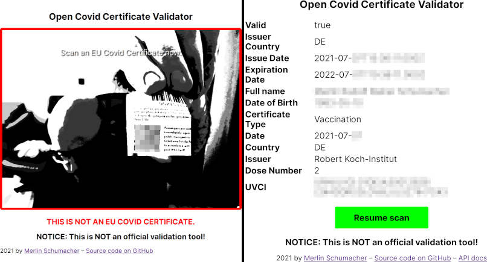

# Open Covid Certificate Validator

This an open source API to validate [EU Digital COVID Certificates](https://ec.europa.eu/info/live-work-travel-eu/coronavirus-response/safe-covid-19-vaccines-europeans/eu-digital-covid-certificate_en). It receives a COVID certificate and validates it using a list of signing certificates provided by a EU member state.

The server provides a simple JSON-API that returns validation result and the data stored inside a certificate. There is also a simple web frontend to test the service.

# NOTICE: THIS IS NOT AN OFFICIAL VALIDATOR!

## Getting started

The easiest way to run OCCV is to use a container. An up to date container is provided via GitHubs Container Image Registry under `ghcr.io/merlinschumacher/open-covid-certificate-validator:main`.

To start the container you need a recent version of Docker and `docker-compose`. Just execute `docker-compose up` and the server will answer on port 8000 of your server. Modify the compose file to fit your needs. Currently only validation against the [german list of certificates](https://github.com/Digitaler-Impfnachweis/certification-apis) provided by Ubirch is supported. The certificates are updated every 24 hours.

To access the API send a POST request containing the following JSON to `/`:

```json
    {"dcc": "HC1:XXXX..."}
```

Replace the payload with the data of the COVID certificate. The server will then return the following answer, if the certificate is valid:

```json
{
  "valid": true,
  "dccdata": {
    "1": "AT",
    "4": 1635876000,
    "6": 1620324000,
    "-260": {
      "1": {
        "v": [
          {
            "dn": 1,
            "ma": "ORG-100030215",
            "vp": "1119349007",
            "dt": "2021-02-18",
            "co": "AT",
            "ci": "URN:UVCI:01:AT:10807843F94AEE0EE5093FBC254BD813#B",
            "mp": "EU/1/20/1528",
            "is": "Ministry of Health, Austria",
            "sd": 2,
            "tg": "840539006"
          }
        ],
        "nam": {
          "fnt": "MUSTERFRAU<GOESSINGER",
          "fn": "Musterfrau-Gößinger",
          "gnt": "GABRIELE",
          "gn": "Gabriele"
        },
        "ver": "1.0.0",
        "dob": "1998-02-26"
      }
    }
  }
}
```

If it's invalid, the server will simply return

```json
{
    "valid":false, 
    "ddcdata":{}
}
```

The `ddcdata` contain all the data encoded in the certificate according to the [specification by the EU](https://ec.europa.eu/health/sites/default/files/ehealth/docs/covid-certificate_json_specification_en.pdf)

## Privacy

While the data encoded in the certificate are sent to the server, they are never stored. They will be processed to generate a response and are deleted afterwards. There is no logging of indidivual data of any kind.

## The web service

This container provides a simple web service to test and validate certificates. It uses your webcam or phone camera to scan a QR code for a certificate and sends it to the API.



## Technology

The API service is written in Python and uses [FastAPI](https://github.com/tiangolo/fastapi) to provide the JSON API. The validation is handled by  [python-cwt](https://github.com/dajiaji/python-cwt), a CBOR Web Token library.

The web interface is still very rudimentary and build in Typescript using [jsQR](https://github.com/cozmo/jsQR) to decode the QR codes.
